# Student Study Portal

[Live Deployed site](https://student-study-portal-9cc1c977016f.herokuapp.com/)

Student Study Portal is a full stack project which allows the students to create notes,save homeworks,Create To-Do list,Search in books, Youtube and Wikipedia.It also has a calculator built-in. One of the major feature of this project is It has a built in discussion forum where students can ask doubts to others people and get answers. The Project was created as apart is Fullstack Software Development Course at Code Institute.

## Contents

- [User Experience](#user-experience)
    -   [User Stories](#user-stories)
    -   [Site Goals](#site-goals)
    -   [Scope](#scope)

- [Design](#design)
    -   [Colour Scheme](#colour-scheme)
    -   [Database Schema](#Database-Schema)
    -   [Fonts](#Fonts)
    -   [Wireframes](#Wireframes)
    -   [Agile Methodology](#Agile-Methodology)
         -   [Overview](#overview)
         -   [EPICS(Milestones)](#epicsmilestones)
         -   [MoSCoW prioritization](#moscow-prioritization)
         -   [GitHub Projects](#github-projects)
[Features](#features)
    -   [Navbar](#Navbar)
    -   [Footer](#Footer)
-   [Home](#Home)

       * [Landing section](#landing-section)
       * [Discussion section](#discussion-section)
       * [Profile section](#profile-section)

-    [Landing section](#landing-section)
        * [Notes](#notes)
        * [Homework](#homework)
        * [To-Do](#to-do)
        * [Youtube](#youtube)
        * [Books](#books)
        * [Wikipedia](#wikipedia)
        * [Calculator](#calculator)
-    [Discussion section](#discussion-section)
        * [Dashboard](#dashboard)
        * [Ask a question](#ask-a-question)
        * [Question and its Answers](#question-and-its-answers)
        * [Answer Form](#answer-form)
        * [Delete and Update Answers](#delete-and-update-answers)
-    [Profile section](#profile-section)
        * [Your Profile](#your-profile)
        * [Delete Account](#delete-account)
        * [Reset Password](#reset-password)
-    [Sign In](#sign-in)
-    [Register](#register)
-   [Future Features](#future-features)
-   [Testing](#testing)
-   [Bugs](#Bugs)
-   [Technologies And Languages](#technologies-and-languages)
    -   [Languages Used](#languages-used)
    -   [Python Modules](#python-modules)
    -   [Technologies and programs](#technologies-and-programs)
-   [Deployment](#deployment)
    -   [Before Deployment](#before-deployment)
    -   [Deployment on Heroku](#deployment-on-heroku)
    -   [Creating A Fork](#creating-a-fork)
    -   [Cloning Repository](#cloning-repository)
-   [Credits](#credits)
    -   [Media](#media)
    -   [Code](#code)
    -   [Acknowledgements](#acknowledgements)
    -   [Comments](#comments)

## User Experience

### User Stories
1. As a developer I can setup a new Django project so that I can create the project's structure.
2. As a developer I can setup a new Django project so that I can create the project's structure.
3. As a developer I can connect database and media storage so that the user's stored data is stored successfully.
4. As a developer I can create wireframes so that the layout of the website is clear for desktop and mobile.
5. As a User I can navigate through the website so that I can access different sections efficiently.
6. As a user I want the website to be responsive so that I can view it on my mobile.
7. As a registered user I want to add notes to the notes section so that I can stores notes about various subjects.
8. As a Registered User I want to open the Home works Page so that I can add Home works to it.
9. As a Registered User I want to have a page for you tube search so that I can search for information in You tube easily.
10. As a Registered User I want to a To-Do Page so that I can add and delete items to it.
11. As a Registered User I want a page for books so that I can search for various books as per requirement.
12. As a Registered User I want a page for Dictionary so that I can search for different word meanings and their pronunciations as per requirement.
13. As a Registered User I want a page for Wikipedia so that I can search for different topics.
14. As a User I want to Register in to have an account so that I can have access to all the features of this website.
15. As a User I want to have a Profile Page so that I can instantly see my pending works.
16. As a User I want to have an account setup so that I can Delete my account if needed.
17. As a User I want to have a Password reset Facility so that I can reset my password if needed.
18. As a Unregistered User I want to redirected to Sign Up page so that I can Instantly Sign up and get access to the website facilities.
19. As a user I want to have a discussion forum so that I can ask my doubts to other people and get answers
20. As an Unregistered User I want to Enter the Discussion Forum so that I can read and be aware of the discussion going on.
21. As a user I want to have access to Home page from the discussion forum so that I can go back to my saved notes and HomeWorks.
22. As a user I want to have access to read each question and its answer so that I can feel and select the interesting ones.
23. As a user I want to have access to answer form so that I can Answer the questions.
24. As a Registered User I want to have edit and delete button to the answers so that edit and delete the answers.
25. As a user I want to have a dashboard button on each page so that I can go back to the dashboard to see other questions.
26. As a user I want to have a dashboard for the Discussion forum so that I can see all the discussions happening.
27. As a developer I want to to validate the code so that the code is according the industry standard.
28. As a developer I want to deploy the project so that I can check the deployed version is same as the developed version.
29. As a developer I want to write the detailed README files so that the project is well documented for future references

### Site Goals

1. To provide students with a place store their Notes and Homeworks.
2. To provide an to create ToDo List and update it.
3. To provide a place for the students where they can browse in YouTube ,Wikipedia and various Books as per requirement.
4. To provide a discussion forum for students to asks questions and to answer them.
5. To provide an integrated study environment for students.
6. To make the website available and functional on every device.

### Scope
The project aims to develop an online platform called "Student Study Portal" that facilitates students in Storing Notes, Homeworks , creating ToDo list and to search in different inbuilt services. It also provides a discussion forum where student can ask questions and also answer others questions.The platform will be responsive and user-friendly, providing features for user registration, creating notes, homeworks and updating them, creating todo list and updating them, searching in wikipedia,Youtube and books. It give access to all users to the discussion forum without registration.

Key Features:
1. Initial Project Setup:

- Developers can set up a new Django project to create the project's structure.
- Database and media storage will be connected to ensure data storage and retrieval.
- An early deployment of the application will be carried out to confirm the initial setup's functionality
.
2. Responsive Design:

-The website will be responsive, allowing users to access it on both desktop and mobile devices.

3. User Authentication:
- Users can register an account, providing access to all functionality of Student Study Portal.
- Registered users can log in to view their homeworks left to be done and other things in the todo list.

4. Profile Management:
- Users can reset their passwords in case they forget them.
- Users can delete their profiles.

8. Notification Messages:
- Users will receive notification messages when performing CRUD operations, login/logout, and signup actions.

## Design
The website features a calming and professional color palette that combines shades of blue, green, and pink with complementary neutrals.  

### Database Schema

#### Models
1. Allauth User Model

The User model is part of Django Allauth. The model comes with predefined fields as standard. Some of them are username, email, name, password, and more. This model is used for user authentication, that's why changes directly to this model are not advised. The User model is connected to the Notes model as a Foreignkey. 

2. Note Model 

The Note model was created to store all the information related to notes created by the user.It is connectes to User model as a ForeignKey.

3. Homework Model

The Homework model was created to store all the information related to Homeworks created by the user.It is connectes to User model as a ForeignKey.

4. Todo Model

The Todo model was created to store all the information related to Todo list created by the user.It is connectes to User model as a ForeignKey.

5. Question Model

The question model was created to store the questions asked by the user.It is connected to the User model as Foreign key.

6. Answer Model

The Answer model was created to store the answers given by the users.It is connected to the User model and Question as Foreign keys.

### Fonts
The font used in this project is fjalla one and Barlow, which compliments the design of the website.  

### Wireframes
- Home 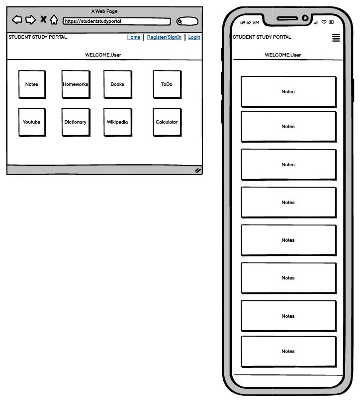
- Notes 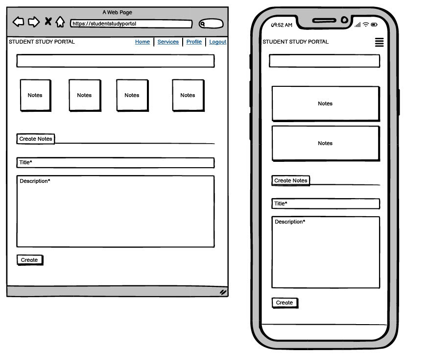
- Homework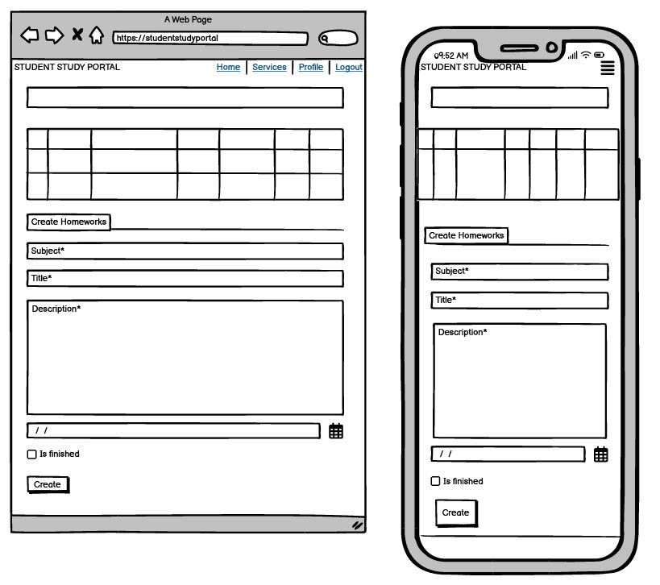
- Todo 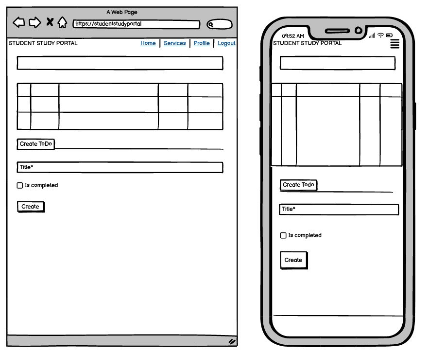
- Discussion Dashboard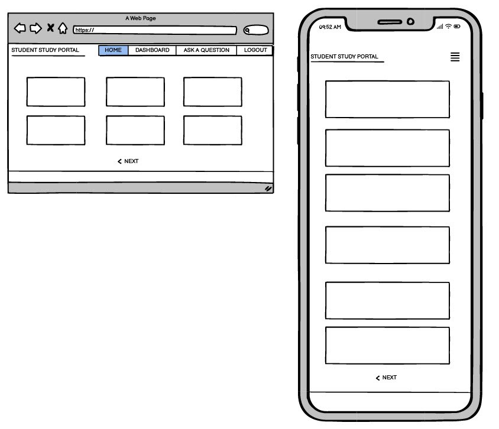
- Discussion page
- Profile 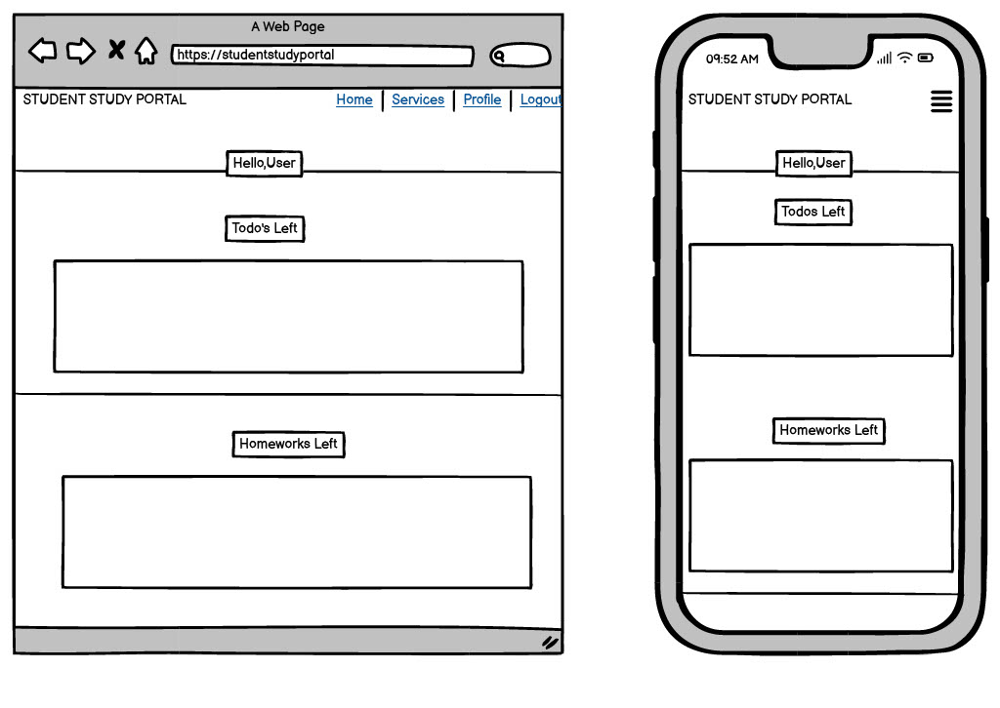

### Agile Methodology
#### Overview
This project was created using agile principles. This was a big learning curve together with my very first full-stack project. Using the agile approach allowed me to plan all the features of the website through user stories. Each user story has acceptance criteria and tasks to clearly outline the requirements for each feature to be completed.

#### EPICS(Milestones)
The user stories are grouped into seven EPICS or Milestones.
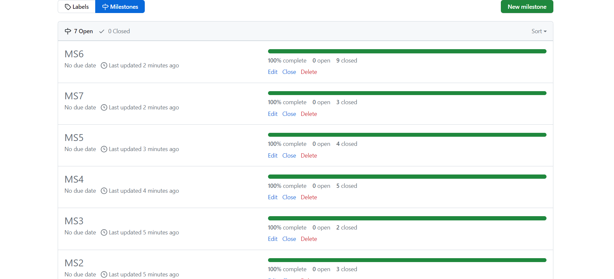

#### MoSCoW prioritization
This prioritization technique was used to effectively prioritize the features and requirements of the project based on their importance. The acronym "MoSCoW" stands for "Must have, Should have, Could have, and Won't have." Each category helps categorize and prioritize features to guide the development process and ensure that the most critical elements are addressed first.  

#### GitHub Projects
The project was created using a basic Kanban Board structure, divided into columns such as Todo, In Progress and Done. This setup provides a clear and organized way to track the status of tasks and visualize and manage the workflow.  
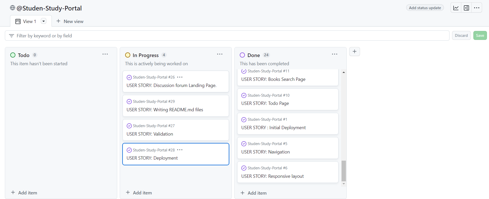

## Features
### Navbar
The navbar is a component that is present on all pages. It was created using Bootstrap and is fully responsive. The 'STUDENT STUDY PORTAL' logo which serves as a link to the homepage is located on the left side on the navbar. On the right are the nav links which allow the user to easily navigate through the website from any point. If the user is not authenticated the links displayed are Home, Register/Signup and Login on the Home and on discussion page Dashboard is also included.These button change their background colors on hovering giving user a better experience.

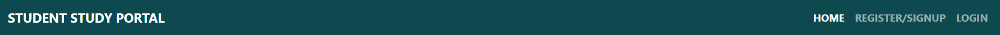

 If the user is authenticated they will see Home, Services,Profile and Logout. The profile link will have the user's username displayed to indicate that the user is logged in. For a better user experience, the Services and Profile button has a dropdown menu with all the facilities denoted. The Home and Logout pages, when active is white and brighter to let the user know the page they are currently on.

 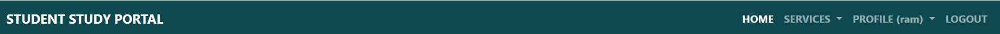

 

 ### Footer
 The Footer is consistent throughout the website with a link to github repository of this project

 

### Home
#### Landing section
The Landing Section displays eight cards with an image ,a title and Small discription of what the user can do there.
They are arranged in two layers. The first layer depicts the services to create and store data and to asks doubt, while the second layer other facilities where the student can search and calculate as per requirement.

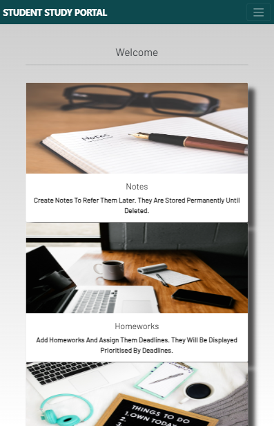

The landing section also displays a greeting to the user with their Username which enhances the user experience.
Among the eight facilities provided the user can access the discussion forum without logging in all other facilities require the user to be logged in to have access to it.

#### Discussion 
The discussion card redirects the user to a page where all the asked questions and ongoing discussions a shown.This page has a header and footer.The header also displays a button to return to home, dashboard and also Ask a question.

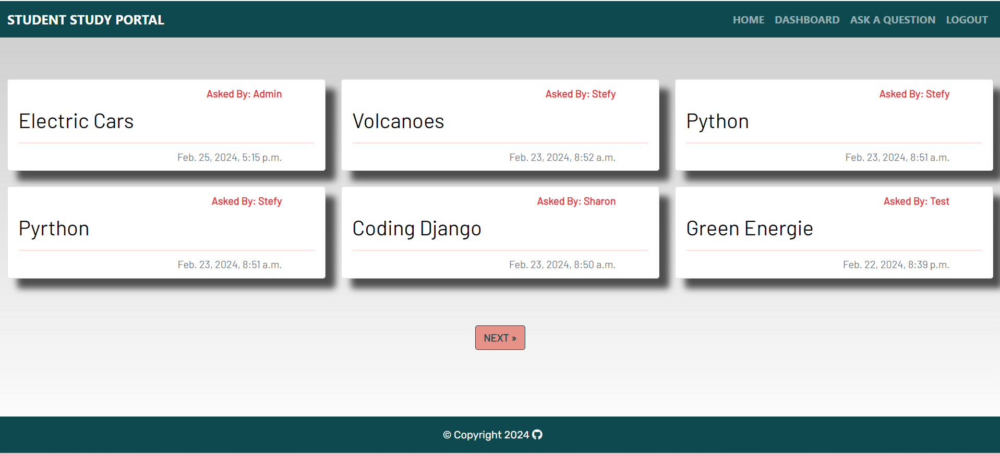

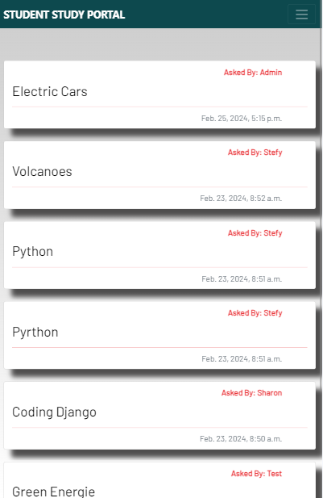

#### Notes
The Notes pages initially displays an form with a message '(Please fill in the form to create Notes and submit it.)'.On filling and submitting the form, a card appears above the form with the title of the note created and its content.A message is also displayed that the notes has been created successfully from the users account.On clicking on the card the user can see the detailed view of the created note.

The note card also has a trash bin icon.On clicking that icon the correcsponding note is deleted and a confirmation message is displayed. 

This page is responsive and the card take up full width on mobile screens. 
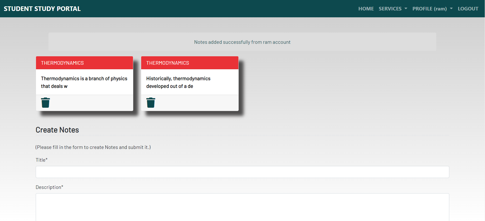
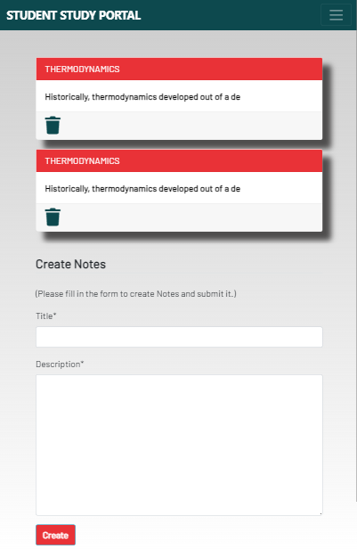

#### Homework
The Homework page initially displays a form to create homeworks. The message bar displays 'You have no pending Home works .Create to have More!!!.
After filling the form with the information and submitting it a table appears with subject, title, due date, status, details.

On clicking the trash-bin in the table the corresponding homework is deleted.

The View Now button displays the homework in detail.

With the check-box in the table we can change the status of the homework .

Respective messages are displayed on adding and deleting homeworks.

On smaller screens the table changes itself into cards with all the information.

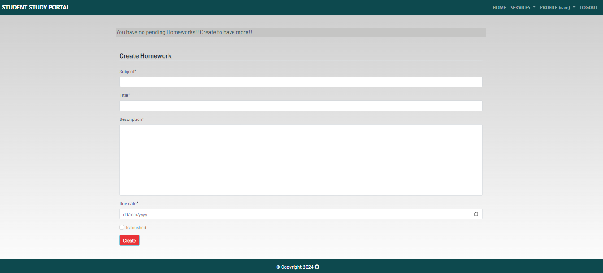
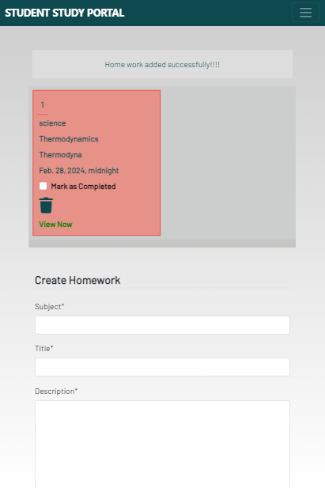

#### To-Do
The to-do page displays a form with a create button. On adding the to-do item into it a table is created with the informations and a message is displayed.

The status of the to-do list items can be updated from the table and the items can also be deleted on clicking the trash-bin icon.
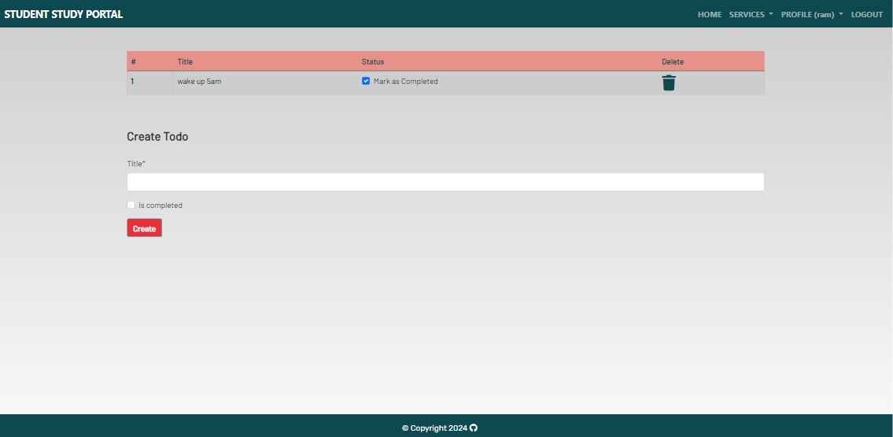
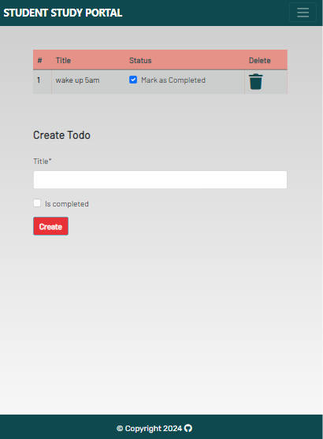

#### Books

The Books page allows the user to search for books related to any topic and read it online or order it.
This page has a search bar where the user can enter their search text. The top ten books are displayed below  along with their details. On clicking the title of the book, the user is redirected to Google Books ina new tab where they can read the book or buy the book.

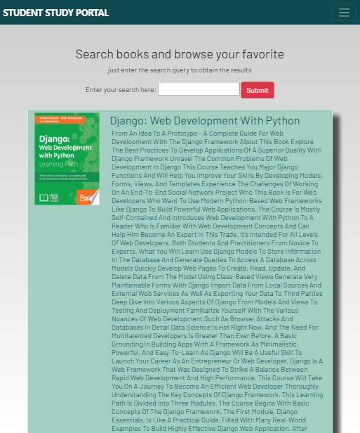

#### YouTube

The YouTube page allows the user to search for youtube videos related to their topics and watch it in a new tab.
This page has a search bar where the user can enter their search text. The top ten videos are displayed with their details and link.On clinking the link the videos opens in a different tab.

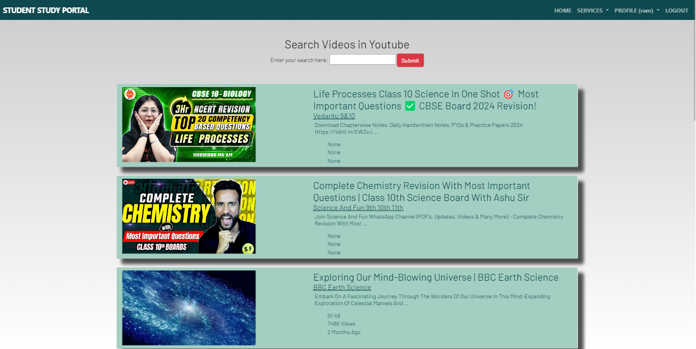
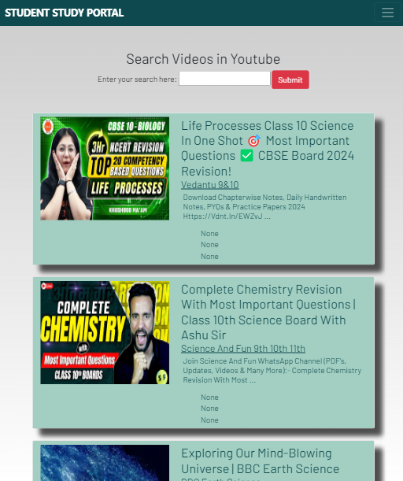

#### Wikipedia

The Wikipedia page allows the user to search for information in Wikipedia related to their topics and read it in a new tab.
This page has a search bar where the user can enter their search text. The information from wikipedia is displayed below with its link in it. On clicking the link the wikipedia page opens in a new tab.

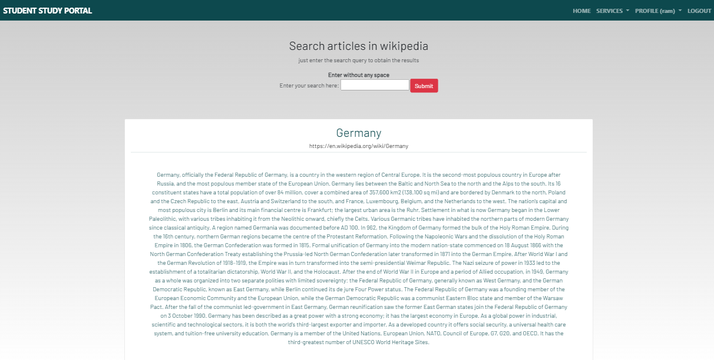
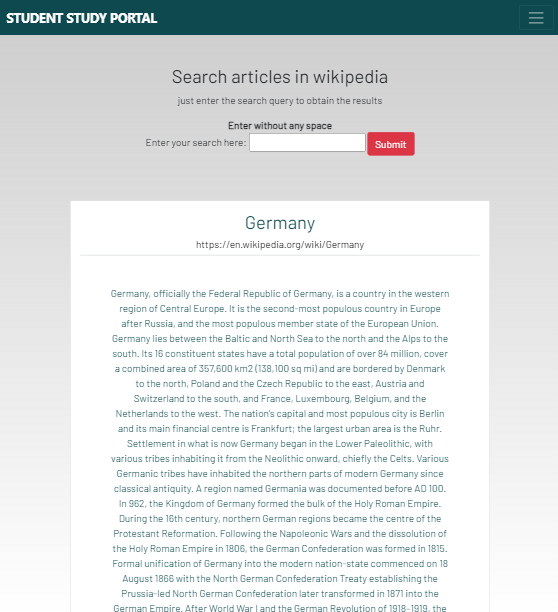

#### Calculator

The Calculator page has a built-in calculator.The user can do basic calculations using it.

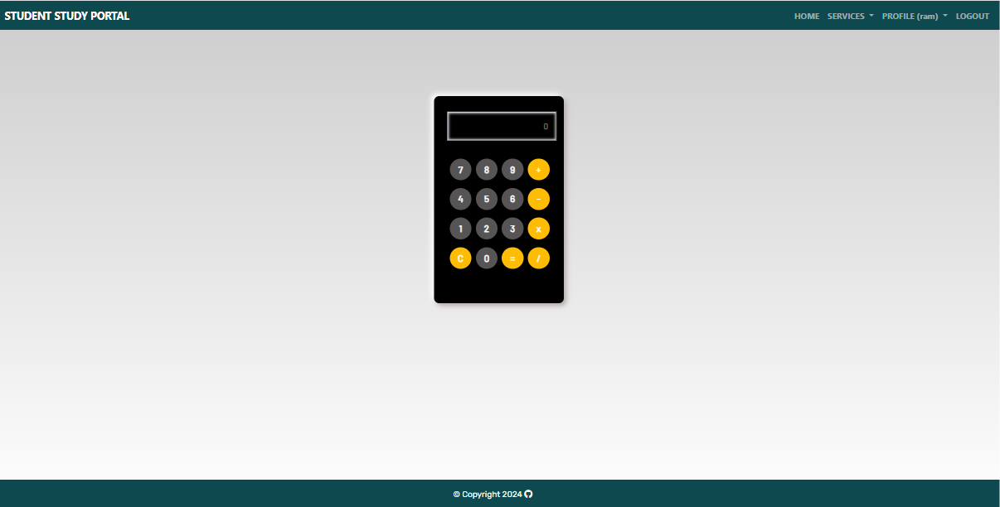
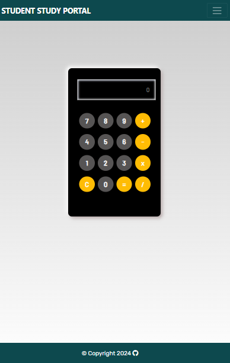

#### Dashboard
While clicking the discussion card on the home page the user is redirected to the Dashboard if the Discussion forum.Here all the asked Questions are displayed in a cards form. Each card displays the Title, Author and posting time.

#### Ask a Question
If the user wants to Ask question, then they have to Login.Once the user logs in, The nav-bar displays a new button 'Ask a Question', which redirects them to a new page with a form.On filling an submitting that form the a new discussion forum is started and it is displayed as a card on the dashboard.

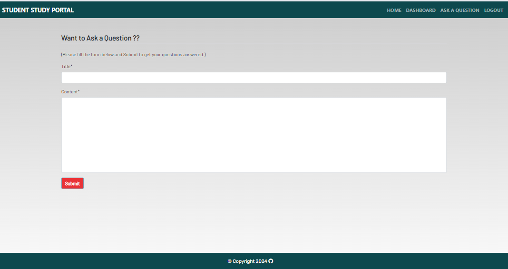
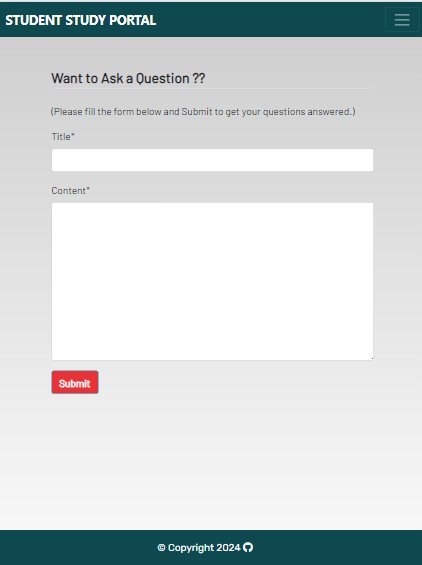

#### Question and its Answers
The discussion form can be visited by any person without logging in. From the dashboard the user can select any topic and click on the respective cards.Then they will be redirected to a page with that particular question and its answers.

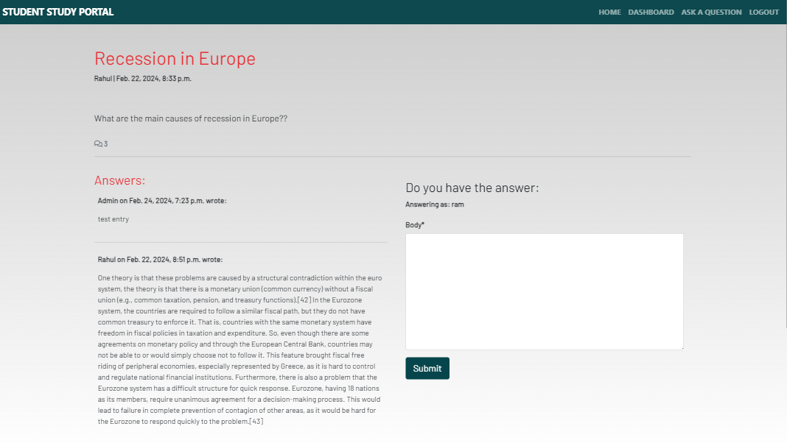

#### Answer Form
If the user wants to answer any of the question, then they have to login and write their answers. Once the user logs in to write the answer, an answer form appears with a submit button.
The user can fill in the form and submit it.

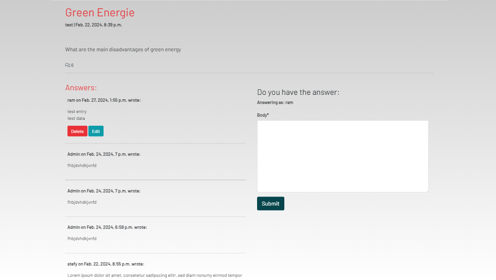

#### Delete and Update Answers
If the logged in person enters an answer and submits it, A Delete and an Edit button appears.It appears only for the answers submitted by the respective user.i.e,They cannot delete or update answers by other users.

On deleting the answer, a modal appears and confirms if the user wants to delete it or not.

On editing the answer, The answer form is populated with the selected answer and can be edited and Updated.

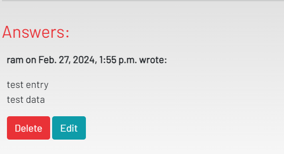

#### Your Profile
The user can visit their profile by clicking the button on the nav-bar.Once they visit 'Your Profile' they will redirected to a page which instantly shows their pending tasks from to-do list and Homework table.

The page has a welcome message with the username which increases user experience.

The tables will be displayed only if they have pending tasks else,a respective message will be displayed.

The table items can be deleted and change in status from profile page. If they click the the trash-bin they can delete the respective elements from each table and the status of the items can also be changed.

Respective buttons for creating todo items and homework items are also provided which redirects the user to the respective forms and help to create the items.

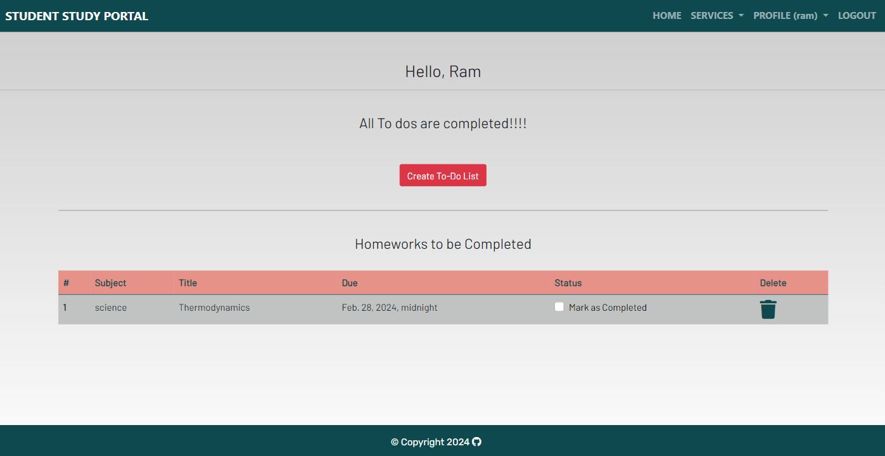

#### Delete Account

When the user wants to delete their account,they can click on the 'Delete Account' button from the dropdown of profile button. Once they click this button, a confirmation message is displayed asking 'If they are sure' and on confirmation the account is deleted and the a confirmation message is diaplayed.

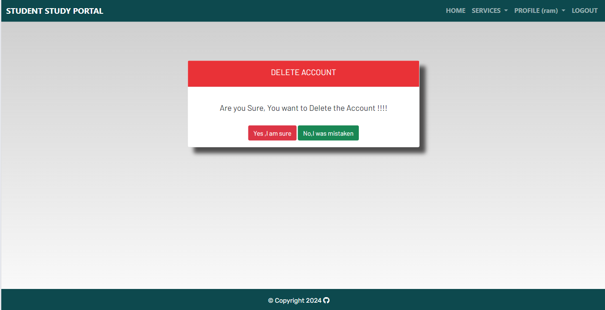
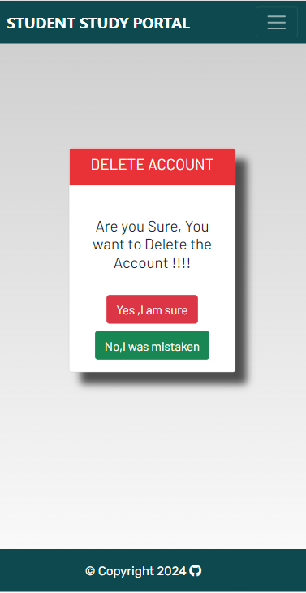

#### Reset Password
When the user wants to reset password ,They can click on the button 'Rest Password' from the Profile button's dropdown and will be redirected to the Password Reset page.The user will be asked to enter the email to which the reset steps are to be sent.After submission a email will be sent to the given email account with sets to reset password.

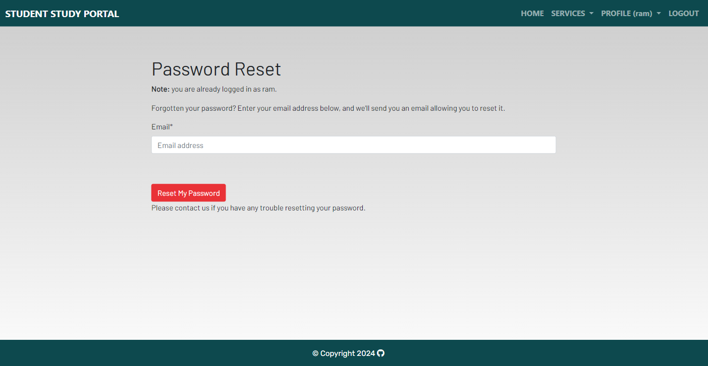
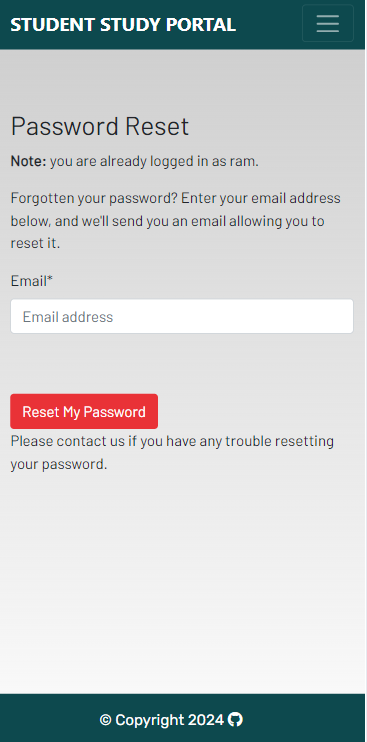

#### Sign-In
Consist of a form with username and password. Below it has a link to sign in, followed by a link to reset password which submits the form.

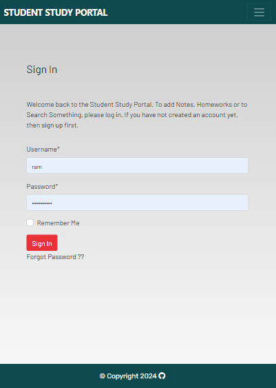

#### Register
Consists of a form with username ,password and an optional email address. The sign in link is also provided in a message below the heading.The Sign Up button is found below the form.

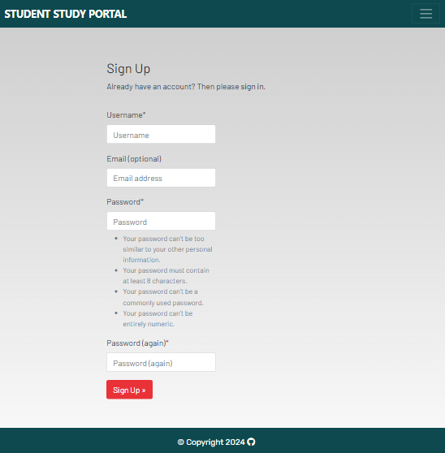

#### Logout
Logout button appears on the nav-bar and and on clicking asks for confirmation .After logging out the user returns to Home page with a message saying 'You have Logged out'.

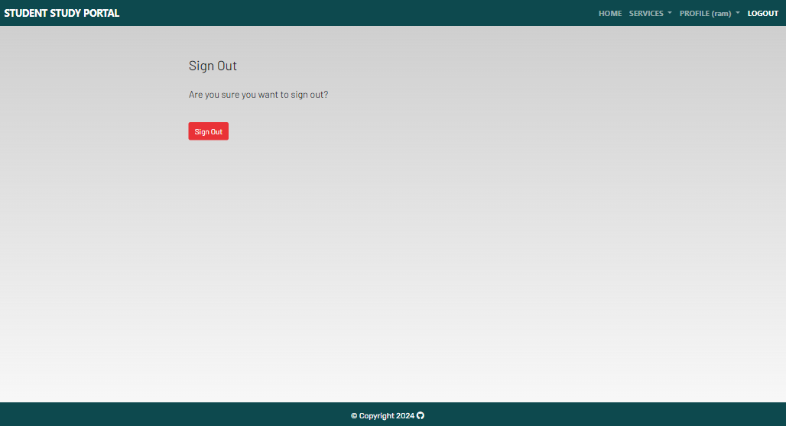
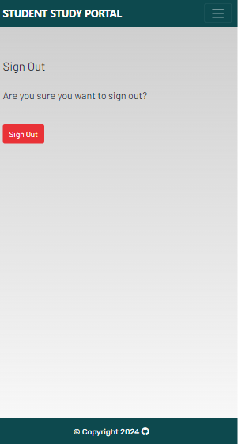

## Future Features
1. I would like to improve the dashboard user experience for the discussion form.
2. I would like to include direct message options for user in discussion panel.
3. I would like to include image options while creating Notes.

## Testing
Testing documentation can be found [here.](./TESTING.md)

## Bugs

## Technologies And Languages
### Languages Used
- HTML
- CSS
- JavaScript
- Bootstrap
- Python
- Django
- Django Rest Framework

### Python Modules
- dj-database-url - This library is used to parse the database URL specified in the DATABASE_URL environment variable, which is commonly used for configuring database connections in Django projects.

- gunicorn - Gunicorn is a popular WSGI (Web Server Gateway Interface) HTTP server for running Python web applications, including Django applications, in a production environment.

-  psycopg2 - Psycopg2 is a PostgreSQL adapter for Python. It allows Django to connect to PostgreSQL databases.

- whitenoise - Whitenoise is a middleware for serving static files directly from your Django application.

- youtube-search-python - It is a library which provides videosearch to search for YouTube videos, channels & playlists & get video information using link. 

- wikipedia - Wikipedia is a Python library that makes it easy to access and parse data from Wikipedia.

### Technologies and programs
* [Favicon Generator](https://favicon.io/favicon-converter/) was used to generate Favicon.
* [Fontawesome Icons](https://fontawesome.com/search?new=yes&o=r) was used to generate Fontawsome icons.
* [GitHub](https://github.com/) is the hosting site used to store the code for the website.
* [Git](https://git-scm.com/) was used as a version control software to commit and push the code to the GitHub repository.
* [Code Institute Template](https://github.com/Code-Institute-Org/gitpod-full-template) was used as a starting point for the project.
* [Google Fonts](https://fonts.google.com/) was used to import fonts.
* [Google Chrome Developer Tools](https://developer.chrome.com/docs/devtools/overview/) was used during testing, debugging and making the website responsive.
* [W3C HTML Validator](https://validator.w3.org/) was used to check for errors in the HTML code.
* [W3C CSS Validator](https://jigsaw.w3.org/css-validator/) was used to check for errors in the CSS code
* [Js Hint](https://jshint.com/) was used to validate the JavaScript code.
* [CI Python Linter](https://pep8ci.herokuapp.com/) was used to validate the Python code.

## Deployment
### Before Deployment
To ensure the application is deployed correctly on Heroku it is mandatory to update the requirements.txt. This is a list of requirements that the application needs in order to run.

- To create the list of requirements we use the command pip3 freeze > requirements.txt. This will ensure the file with the requirements is updated.
- Then commit and push the changes to GitHub.
- ! Before pushing code to GitHub ensure all credentials are in an env.py file, which is included in the .gitignore file. This tells Git not to track this file which will prevent it from being added to Github and the credentials being exposed.

### Deployment on Heroku
- To deploy the project on Heroku, first create an account.
- Once logged in, create a new app by clicking on the create app button
- Pick a unique name for the app, select a region, and click Create App.
- On the next page select the settings tab and scroll down to Config Vars. If there are any files that should be hidden like credentials and API keys they should be added here. In this project, there are credentials that need to be protected. This project requires credentials added for:
1. Django's secret key
2. Database Credentials
3. Email host password.
- Scroll down to Buildpacks. The buildpacks will install further dependencies that are not included in the requirements.txt. For this project, the buildpack required is Python
- From the tab above select the deploy section.
- The deployment method for this project is GitHub. Once selected, confirm that we want to connect to GitHub, search for the repository name, and click connect to connect the Heroku app to our GitHub code.
- Scroll further down to the deploy section where automatic deploys can be enabled, which means that the app will update every time code is pushed to GitHub. Click deploy and wait for the app to be built. Once this is done, a message should appear letting us know that the app was successfully deployed with a view button to see the app.
### Creating a fork
1. Navigate to the [repository](https://github.com/sari-rahul/Studen-Study-Portal)
2. In the top-right corner of the page click on the fork button and select create a fork.
3. You can change the name of the fork and add description 
4. Choose to copy only the main branch or all branches to the new fork. 
5. Click Create a Fork. A repository should appear in your GitHub

### Cloning Repository
1. Navigate to the [repository](https://github.com/sari-rahul/Studen-Study-Portal)
2. Click on the Code button on top of the repository and copy the link. 
3. Open Git Bash and change the working directory to the location where you want the cloned directory. 
4. Type git clone and then paste the link.
5. Press Enter to create your local clone.

## Credits
### Media
- All the images on the landing page were taken from [Pexels](https://www.pexels.com/).

### Code
- Learned how to setup django project and deploy to Heroku from CI Django Blog walkthrough.
- I learned how to create dropdown menu buttons from [codemy.com](https://www.youtube.com/@Codemycom).
- I have also reffered [Programming with Mosh](https://www.youtube.com/@programmingwithmosh), [Brototype Malayalam](https://www.youtube.com/@BrototypeMalayalam) and [Yes tech media](https://www.youtube.com/@YesTechMedia) you tube channels.

### Acknowledgements
- Huge thanks you to my mentor Jubrile Akolade for encouraging me to go with my very ambitious idea for my first full-stack project.
- The Slack community who listened to my struggles during development.
