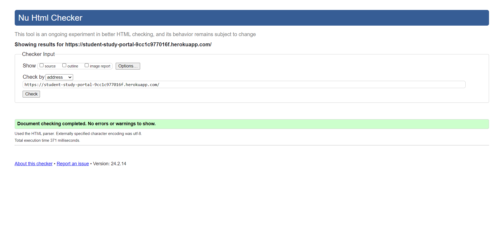
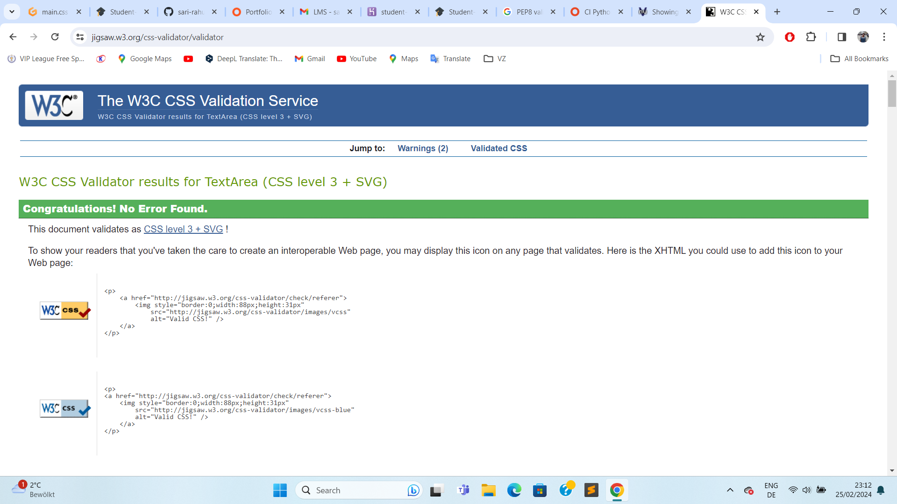
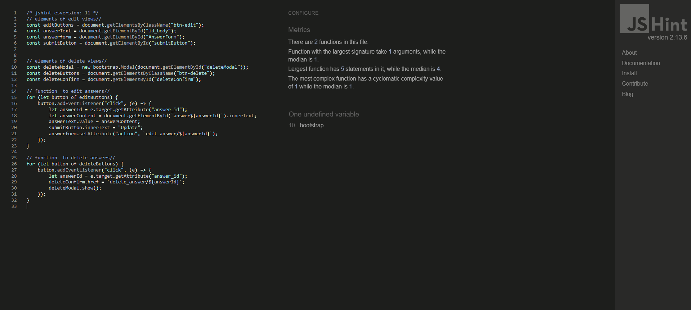
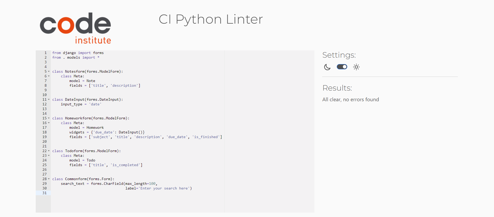
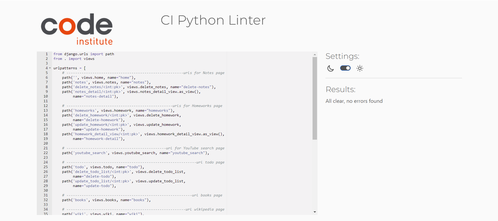
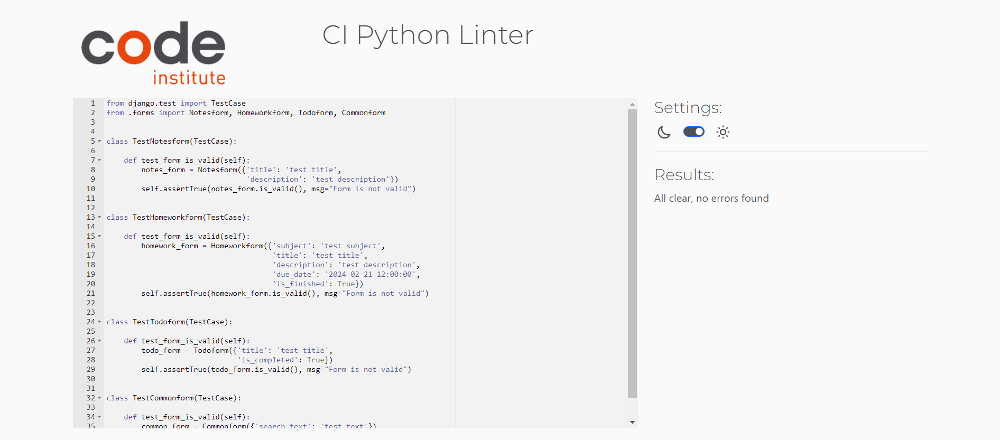
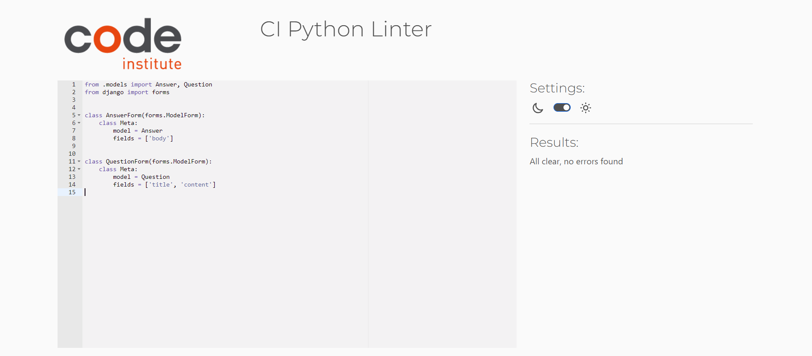
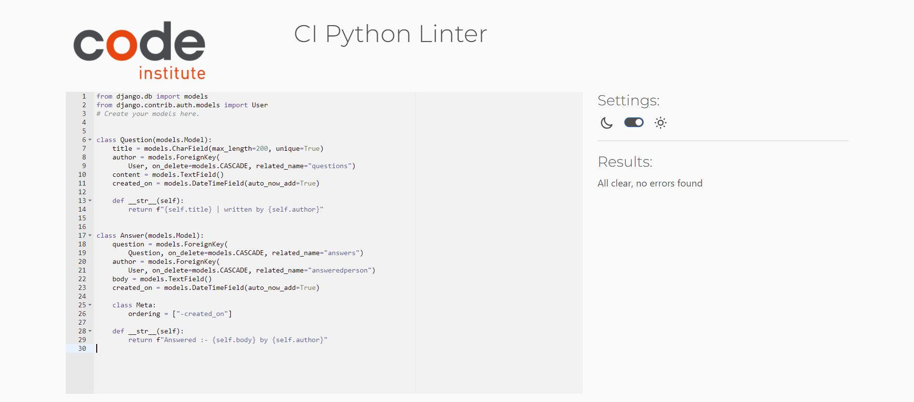
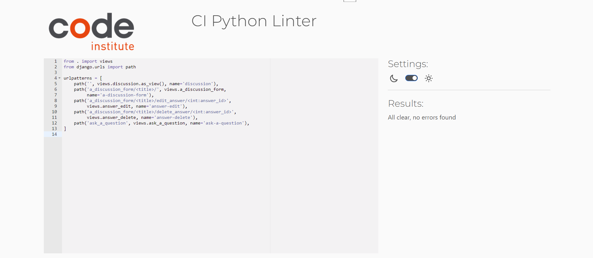

Go back to [README.md](/README.md)

# Testing
- [Code Validation](#code-validation)
    - [HTML](#html)
    - [CSS](#css)
    - [JavaScript](#JavaScript)
    - [Python](#python)
- [Responsiveness](#Responsiveness)
- [Browser Compatibility](#browser-compatibility)
- [Lighthouse](#Lighthouse)
- [Manual Testing](#manual-testing)

## Code Validation
### HTML

This project has been validated and passed through W3School Validator without any errors.

### CSS
This project has been validated and passed through Jigsaw Validator without any errors.

### Javascript
The javascript files were tested using Jshint and has passed without any errors.

### Python
|Page   | Validation   | Result  |
|--- |--- |---|
| Dashboard forms.py||PASS|
|Dashboard models.py ||PASS|
|Dashboard urls.py||PASS|
|Dashboard test_form.py||PASS|
|Dashboard test_views.py||PASS|
|Dashboard views.py||PASS|
|Discussion forms.py|| PASS|
|Discussion models.py ||PASS|
|Discussion urls.py||PASS |
|Discussion views.py||PASS |

## Responsiveness
During development each page was tested using dev tools in Google Chrome. The strategy involved ensuring that every page would adapt to various screen sizes beyond a width of 320px, as opposed to relying on fixed device-specific widths.
Further testing was done on mobile to confirm all is working as expected.

|Device|Screen Size|Pass/Fail|Comment|
| --- | --- | --- | ---|
| Iphone SE | 375x667 | PASS | All sections are displayed correctly. All features work|
| Iphone 12 Pro | 390x844 | PASS | All sections are displayed correctly. All features work|
| Samsung Galaxy s20U | 412x915 | PASS | All sections are displayed correctly. All features work|
| Galaxy Tab S4 | 712x1138| PASS | All sections are displayed correctly. All features work|
| Nest Hub | 1024x600 | PASS | All sections are displayed correctly. All features work|